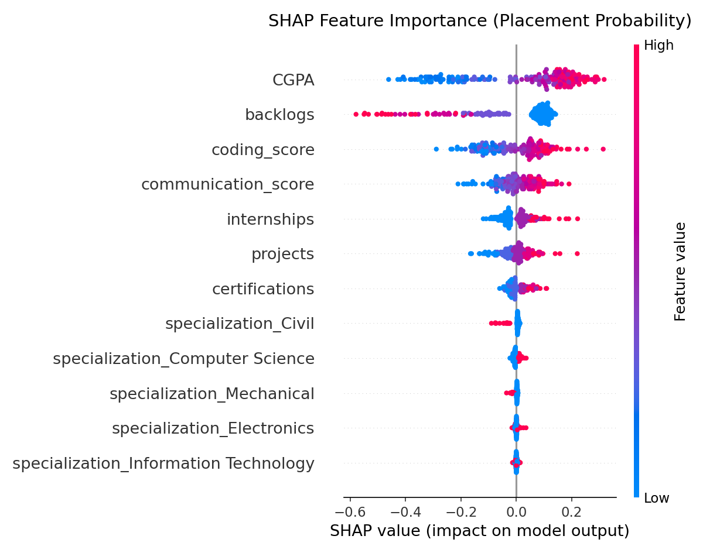
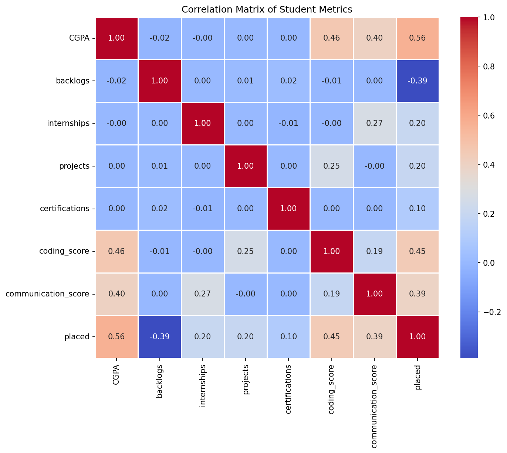

# 🚀 PlacePrep AI — Placement Readiness & Skill Gap Analytics System

> An end-to-end AI-powered placement readiness evaluator, machine learning scoring engine, and RAG-driven 4-week personalized technical learning plan builder for students and job applicants.

---

## 📸 Application Screenshots & Output Previews

### 🎯 4-Week Personalized Technical Learning Plan


### 🤖 Explainable AI (XAI) Model Decision & SHAP Feature Impact
| 🧠 Explainable AI Feature Summary | 📊 Data Feature Analytics |
| :---: | :---: |
|  |  |

---

## 🌟 Key Features

- 📄 **Intelligent Resume Parsing**: Extracts student CGPA, internships, projects, certifications, specialization branch, and technical skills from PDF and DOCX resumes.
- 🎯 **Machine Learning Placement Scoring**: Evaluates candidate placement readiness score (0–100%) using a trained Random Forest classifier.
- 🤖 **Explainable AI (XAI) Feature Impact**: Provides clear, human-readable model decision reasoning for every candidate attribute (CGPA, internships, projects, certifications, soft skills).
- 📊 **Dynamic Skill Gap Breakdown**: Compares candidate skills against job description requirements using exact and semantic cosine similarity matching (Categorized into *Matched*, *Partially Matched*, and *Missing*).
- 📅 **Dual-Tier 4-Week Personalised Roadmap**: Builds a 4-week technical learning plan focused 100% on **Core Technical Skills** (*Excel, SQL, Python, R, Java, C++, React, AWS, Docker*) paired with weekly **Soft Skill Assessment Rubrics** (20% weight).
- 🧠 **Hybrid RAG Recommendation Engine**: Combines exact skill tagging with FAISS vector similarity search (`SentenceTransformer('all-MiniLM-L6-v2')`) to retrieve top curated learning courses, YouTube tutorials, and certifications.
- 🎨 **Modern React & Aurora Glassmorphism Dashboard**: Interactive score gauges, radar alignment charts, status bar charts, and week accordions built with Vite, React, and Recharts.

---

## 🛠️ Technology Stack

- **Backend**: Python 3.10+, FastAPI, Uvicorn, Pydantic, SQLite
- **Machine Learning**: Scikit-Learn (Random Forest), Joblib, NumPy, Pandas
- **NLP & RAG**: Sentence-Transformers (`all-MiniLM-L6-v2`), FAISS Vector Index, PyPDF2, pdfplumber, docx2txt
- **Frontend**: React 18, Vite, React Router DOM, Recharts, Lucide Icons
- **Styling**: Vanilla CSS3 (Custom Design System, Glassmorphism, Aurora Gradients)

---

## 📁 Repository Structure

```text
AI-Placement-Readiness-Skill-Gap-System/
├── docs/
│   └── images/             # Screenshots and preview visual assets for README
├── backend/
│   ├── db/                 # SQLite database session & ORM models
│   ├── routers/            # FastAPI endpoint handlers (/parse-resume, /predict, /full-analysis, /recommendations)
│   ├── limiter.py          # SlowAPI rate limiting configuration
│   ├── main.py             # FastAPI app initialization & CORS setup
│   └── schemas.py          # Pydantic request & response models
├── frontend/
│   ├── public/             # Static public assets & icons
│   ├── src/
│   │   ├── api/            # Axios API client setup
│   │   ├── pages/          # React pages (Upload, Dashboard, Recommendations)
│   │   ├── App.jsx         # Main application routes & Navbar
│   │   ├── index.css       # Global design tokens & CSS system
│   │   └── main.jsx        # React entrypoint
│   ├── package.json        # Frontend dependencies
│   └── vite.config.js      # Vite dev server configuration
├── data/
│   ├── learning_resources.json # Curated catalog of courses, YouTube videos & certifications
│   ├── placement_data.csv      # Historical dataset used for model training
│   └── resume.csv              # Annotated resume dataset
├── models/
│   ├── placement_model.pkl    # Trained Random Forest classifier
│   └── preprocessor.joblib    # Feature scaler & transformer
├── src/
│   ├── data_prep.py        # Dataset preprocessing pipeline
│   ├── explain.py          # XAI feature explanation generator
│   ├── recommendation.py   # Hybrid RAG recommendation engine & 4-week roadmap assembler
│   ├── resume_parser.py    # Multi-format PDF/DOCX resume parser
│   ├── skill_gap.py        # Cosine & string matching skill gap analyzer
│   └── train_model.py      # Random Forest model training script
├── Dockerfile              # Container deployment recipe
├── render.yaml             # Render cloud deployment specification
├── requirements.txt        # Python backend dependencies
└── run_backend.py          # Standalone backend server runner script
```

---

## ⚡ Quick Start Guide

### Prerequisites

Ensure you have the following installed on your machine:
- **Python**: `3.10` or higher ([Download Python](https://www.python.org/downloads/))
- **Node.js**: `v18.0` or higher ([Download Node.js](https://nodejs.org/))
- **Git**: Installed and configured

---

### Step 1: Clone the Repository

```bash
git clone https://github.com/dpoo61524-cloud/AI-Placement-Readiness-Skill-Gap-System.git
cd AI-Placement-Readiness-Skill-Gap-System
```

---

### Step 2: Set Up Backend (Python)

1. **Create and Activate Virtual Environment** (Optional but recommended):
   - **Windows**:
     ```bash
     python -m venv venv
     venv\Scripts\activate
     ```
   - **macOS/Linux**:
     ```bash
     python3 -m venv venv
     source venv/bin/activate
     ```

2. **Install Backend Dependencies**:
   ```bash
   pip install -r requirements.txt
   ```

3. **Start Backend Server**:
   ```bash
   python run_backend.py
   ```
   > The FastAPI backend will start running on **`http://localhost:8000`**.  
   > You can view interactive API docs at `http://localhost:8000/docs`.

---

### Step 3: Set Up Frontend (React + Vite)

Open a **new terminal window** and navigate to the `frontend` folder:

1. **Navigate to Frontend Directory**:
   ```bash
   cd frontend
   ```

2. **Install Node Dependencies**:
   ```bash
   npm install
   ```

3. **Start Frontend Dev Server**:
   ```bash
   npm run dev
   ```
   > The React app will start running on **`http://localhost:5173`**.

---

## 🖼️ How to Add / Replace Application Screenshots

To add or update screenshots on GitHub:
1. Take a screenshot of your app page (e.g., Upload page or Dashboard page).
2. Save the PNG image inside the **`docs/images/`** folder (e.g., `upload_page.png` or `dashboard_page.png`).
3. Add the markdown link inside **`README.md`**:
   ```markdown
   
   ```
4. Push to GitHub:
   ```bash
   git add docs/images/ README.md
   git commit -m "Update application screenshots"
   git push origin main
   ```

---

## 🔌 API Endpoints Summary

| Method | Endpoint | Description |
| :--- | :--- | :--- |
| `GET` | `/health` | Health check endpoint returning database and backend status. |
| `POST` | `/parse-resume` | Upload a PDF/DOCX resume file to extract profile attributes and skills. |
| `POST` | `/predict` | Predict placement readiness score (0-100%) from candidate features. |
| `POST` | `/skill-gap` | Analyze candidate resume skills against target job description requirements. |
| `POST` | `/recommendations` | Generate personalized 4-week core technical learning plan & certifications. |
| `POST` | `/full-analysis` | Execute complete end-to-end analysis (Resume parsing + ML Prediction + Skill Gap + 4-Week Roadmap) in a single request. |

---

## 📜 License

Distributed under the **MIT License**. See `LICENSE` for more details.

---

## 👤 Author

**Deeksha Poojari**  
GitHub: [@dpoo61524-cloud](https://github.com/dpoo61524-cloud)
